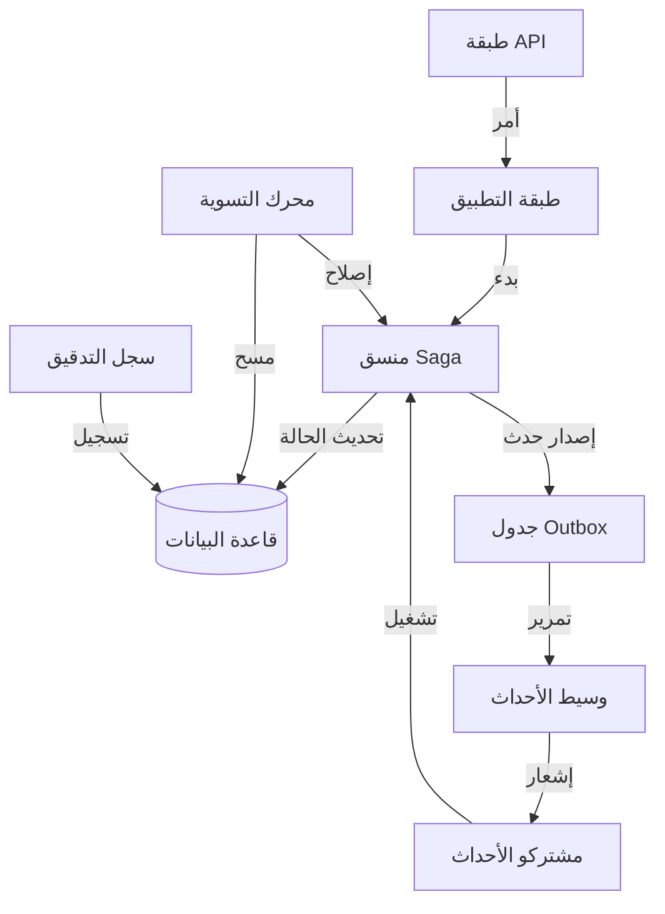

# تحليل معماري عميق وخطة إعادة بناء (التطور إلى درجة بنكية)

## 1. تحليل النظام الحالي
يطبق النظام الحالي **معمارية قائمة على الأحداث (Event-Driven Architecture)** باستخدام **نمط Outbox** و **تنسيق Saga**. على الرغم من أن الأساس متين، إلا أنه يفتقر حاليًا إلى الصرامة المطلوبة لنظام مالي من "الدرجة البنكية". تدور المشكلات الأساسية حول **الحتمية (determinism)** و **سلامة الأنواع (type safety)** و **تحمل الأخطاء (fault tolerance)**.

### المكونات الأساسية:
- **EscrowSaga & PaymentSaga**: تنسيق منطق العمل.
- **SagaManager**: يتعامل مع استمرارية حالات الـ Saga.
- **EventContract**: يحدد مخططات Zod للأحداث.
- **Outbox**: يضمن تسليم الأحداث مرة واحدة على الأقل.

---

## 2. نقاط الضعف الدقيقة (على مستوى الملف)

| الملف | نقطة الضعف | السبب | انتهاك القاعدة |
| :--- | :--- | :--- | :--- |
| `EscrowSaga.ts` | `Record<string, unknown>` | نقص في سلامة الأنواع لحالة الـ Saga. | القاعدة 3 |
| `EscrowSaga.ts` | `new Date()` | معالجة زمنية غير حتمية. | القاعدة 10 |
| `PaymentSaga.ts` | `new Date()` | معالجة زمنية غير حتمية. | القاعدة 10 |
| `SagaManager.ts` | `Record<string, unknown>` | معالجة الحالة العامة تمنع التحقق الصارم. | القاعدة 3 |
| `EventContract.ts` | لا يوجد توقيع للأحداث | يمكن تزييف الأحداث أو التلاعب بها. | القاعدة 5 |
| `EscrowSaga.ts` | تعويض ضعيف | يتم تمييز الـ Saga كـ `FAILED` قبل اكتمال التعويض. | القاعدة 4 |
| `DrizzleEscrowRepository.ts` | Outbox غير مكتمل | غياب منطق إعادة المحاولة وتتبع الأخطاء في قاعدة البيانات. | القاعدة 11 |

---

## 3. خطة إعادة البناء (خطوة بخطوة)

### المرحلة الأولى: تقوية الأساس (القواعد 3، 10، 13، 14)
1.  **تحديد واجهات حالة Saga صارمة**: استبدال كل `Record<string, unknown>` بواجهات TypeScript مُحققة بواسطة Zod لكل Saga.
2.  **حقن الوقت وتوليد المعرفات**: إنشاء واجهة `SystemClock` و `IdGenerator` لضمان الحتمية أثناء إعادة تشغيل الأحداث.
3.  **عزل منطق المجال**: التأكد من أن نماذج المجال `Escrow` و `Payment` نقية ولا تعتمد على البنية التحتية.

### المرحلة الثانية: آلة الحالة والتعويض (القواعد 1، 2، 4)
1.  **تنفيذ آلة حالة كاملة**: توسيع `SagaStatus` لتشمل `AUTHORIZED`، `CAPTURED`، `COMPENSATING`، `COMPENSATED`.
2.  **التحقق الصارم من الانتقالات**: تنفيذ `TransitionGuard` يمنع القفزات غير الصالحة في الحالة.
3.  **دورة تعويض مغلقة**: تحديث `EscrowSaga` لانتظار `payment.refunded` (COMPENSATED) قبل الانتقال إلى `FAILED`.

### المرحلة الثالثة: أمان الأحداث والإصدارات (القواعد 5، 6، 17)
1.  **توقيع الأحداث**: تنفيذ توقيع HMAC-SHA256 لجميع أحداث Outbox.
2.  **إصدار المخططات**: إضافة `schemaVersion` إلى الأحداث وتنفيذ سجل للتوافق مع الإصدارات السابقة.
3.  **تقوية المدخلات**: إضافة تحقق Zod عالمي لجميع طلبات API الواردة.

### المرحلة الرابعة: الموثوقية والشفاء الذاتي (القواعد 7، 8، 9، 11، 12، 18، 19، 20)
1.  **تقوية Outbox**: تنفيذ التراجع الأسي (exponential backoff) وقائمة انتظار الرسائل الميتة (DLQ) لمعالج Outbox.
2.  **محرك التسوية (Reconciliation Engine)**: بناء عامل خلفية يقوم بمسح الـ Sagas "العالقة" (على سبيل المثال، `PROCESSING` لأكثر من 5 دقائق) وتشغيل الاسترداد.
3.  **إعادة تشغيل الأحداث**: تنفيذ أداة لإعادة بناء حالة التجميع عن طريق إعادة تشغيل الأحداث من Outbox.
4.  **اختبار الفوضى (Chaos Testing)**: إضافة اختبارات تحاكي الأحداث المكررة/خارج الترتيب للتحقق من الثباتية (idempotency).

---

## 4. تحليل المخاطر

| الخطر | التأثير | التخفيف |
| :--- | :--- | :--- |
| **عدم اتساق البيانات** | مرتفع | استخدام معاملات قاعدة البيانات لجميع تحديثات الحالة وكتابات Outbox. |
| **عبء الأداء** | متوسط | استخدام الفهرسة على حقلي `correlationId` و `status` في قاعدة البيانات. |
| **زيادة التعقيد** | متوسط | الحفاظ على وثائق واضحة واستخدام أنماط قياسية (Saga, Outbox). |
| **تغييرات كاسرة** | منخفض | استخدام إصدارات الأحداث لضمان التوافق مع الإصدارات السابقة أثناء الترحيل. |

---

## 5. المخطط المعماري النهائي (مفاهيمي)

---

## 6. الانتقال إلى التنفيذ

سأنتقل الآن إلى **المرحلة الأولى** من خطة إعادة البناء، بدءًا من تحديد واجهات حالة Saga الصارمة وإصلاح مشكلات الحتمية.
