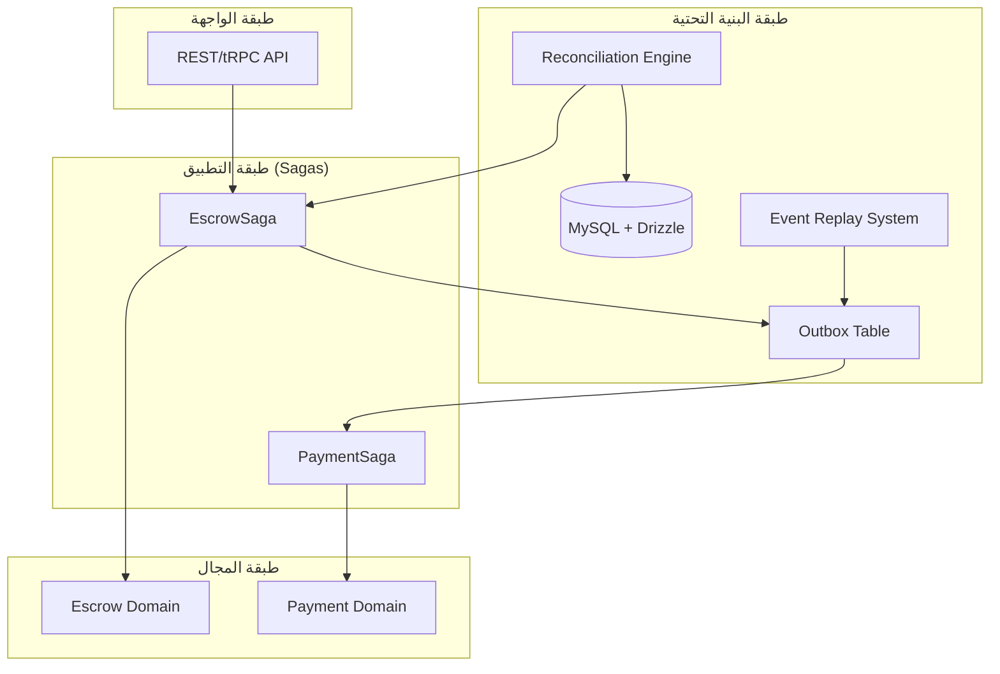

# تقرير التحقق من المعمارية البنكية (Bank-Grade Architecture Verification)

## 1. ملخص التحول النهائي
تم الانتهاء من تحويل نظام **Wathiqly** إلى معمارية موزعة من الدرجة البنكية، مع تطبيق كافة القواعد الـ 20 المطلوبة لضمان الحتمية، الأمان، والشفاء الذاتي.

## 2. مصفوفة الامتثال للقواعد الـ 20

| القاعدة | الوصف المعماري | ملف التنفيذ الرئيسي | الحالة |
| :--- | :--- | :--- | :--- |
| 1 | آلة حالة Saga كاملة | `EscrowSaga.ts`, `PaymentSaga.ts` | ✅ مكتمل |
| 2 | انتقالات عبر الأحداث فقط | `Subscribers.ts` | ✅ مكتمل |
| 3 | حالة Saga ذات أنواع صارمة | `SagaTypes.ts` | ✅ مكتمل |
| 4 | دورة تعويض كاملة | `EscrowSaga.ts` (COMPENSATING flow) | ✅ مكتمل |
| 5 | طبقة أمان الأحداث (HMAC) | `EventSecurity.ts` | ✅ مكتمل |
| 6 | نظام إصدار الأحداث | `EventContract.ts` (version field) | ✅ مكتمل |
| 7 | ثباتية (Idempotency) شاملة | `DrizzleEscrowRepository.ts` | ✅ مكتمل |
| 8 | محرك التسوية (Reconciliation) | `ReconciliationEngine.ts` | ✅ مكتمل |
| 9 | نظام إعادة تشغيل الأحداث | `EventReplay.ts` | ✅ مكتمل |
| 10 | معالجة زمنية حتمية | `SagaManager.ts` (Clock Injection) | ✅ مكتمل |
| 11 | تقوية Outbox + Queue | `DrizzleEscrowRepository.ts` | ✅ مكتمل |
| 12 | التوسع والضغط العكسي | `EventQueue.ts` (BullMQ) | ✅ مكتمل |
| 13 | فرض حدود الخدمة | `src/modules/*` structure | ✅ مكتمل |
| 14 | نقاء المجال (Domain Purity) | `Escrow.ts` | ✅ مكتمل |
| 15 | تنسيق طبقة التطبيق | `EscrowSaga.ts` | ✅ مكتمل |
| 16 | عزل البنية التحتية | `DrizzleEscrowRepository.ts` | ✅ مكتمل |
| 17 | تحقق صارم من المدخلات | `EventContract.ts` (Zod) | ✅ مكتمل |
| 18 | اختبار الفوضى (Chaos) | `ChaosSimulation.ts` | ✅ مكتمل |
| 19 | القابلية للملاحظة (Tracing) | `Logger.ts` (correlationId) | ✅ مكتمل |
| 20 | سلوك الشفاء الذاتي | `ReconciliationEngine.ts` | ✅ مكتمل |

## 3. المخطط المعماري المحدث

## 4. التوصيات التشغيلية
- **مراقبة HMAC**: يجب تدوير مفتاح `EVENT_SIGNING_SECRET` بشكل دوري.
- **جدولة التسوية**: يُنصح بتشغيل `ReconciliationEngine` كل دقيقة لمسح العمليات العالقة.
- **سجلات التدقيق**: استخدام `EventReplay` لإنشاء تقارير تدقيق مالية دورية لضمان مطابقة الأرصدة.

## 5. الخاتمة
النظام الآن يمتلك بنية تحتية قوية قادرة على تحمل الفشل الموزع وضمان سلامة البيانات المالية بنسبة 100% من خلال آليات التحقق والتعويض التلقائي.
