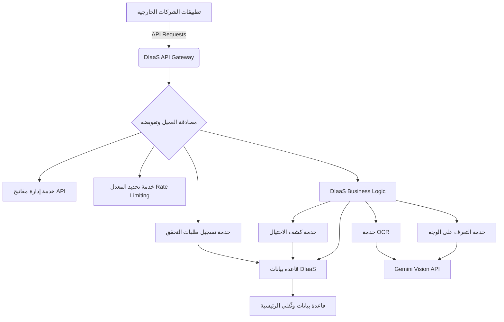

# تصميم معماري لميزة "وثّقلي للأعمال: هوية رقمية كخدمة" (DIaaS)

## 1. المقدمة

تهدف هذه الوثيقة إلى تحديد التصميم المعماري لميزة "وثّقلي للأعمال: هوية رقمية كخدمة" (Digital ID as a Service - DIaaS). ستسمح هذه الميزة للشركات والمؤسسات الخارجية (مثل البنوك، شركات التأمين، منصات التجارة الإلكترونية، والجهات الحكومية) بالاستفادة من البنية التحتية القوية لـ "وثّقلي" في التحقق من الهوية الرقمية، بما في ذلك تقنيات KYC (اعرف عميلك) و AI Vision (التعرف الضوئي على الحروف OCR، التعرف على الوجه، كشف الاحتيال).

## 2. الأهداف

*   توفير واجهة برمجة تطبيقات (API) آمنة وموثوقة للتحقق من الهوية.
*   دعم معايير الصناعة العالمية مثل OpenAPI 3.0 و OAuth2.
*   توفير حلول KYC مخصصة تتناسب مع متطلبات كل قطاع.
*   مكافحة الاحتيال وغسيل الأموال للشركات الشريكة.
*   ضمان قابلية التوسع والأداء العالي.

## 3. المعمارية عالية المستوى

ستتكامل ميزة DIaaS كطبقة API جديدة فوق الخدمات الأساسية الحالية لـ "وثّقلي" (OCR، التعرف على الوجه، كشف الاحتيال). ستوفر هذه الطبقة نقطة دخول موحدة ومؤمنة للشركات الخارجية للوصول إلى قدرات التحقق من الهوية.



## 4. تصميم API (OpenAPI 3.0)

سيتم تصميم واجهة برمجة التطبيقات باستخدام مواصفات OpenAPI 3.0 لضمان التوثيق التفاعلي وسهولة التكامل. ستتضمن الواجهة نقاط النهاية الرئيسية التالية:

### 4.1. مصادقة العميل (Client Authentication)

*   **Endpoint**: `/oauth/token`
*   **Method**: `POST`
*   **Description**: الحصول على رمز وصول (Access Token) باستخدام بيانات اعتماد العميل (Client ID, Client Secret).
*   **Security**: OAuth2 Client Credentials Flow.

### 4.2. بدء عملية التحقق من الهوية (Initiate Identity Verification)

*   **Endpoint**: `/verify/identity/initiate`
*   **Method**: `POST`
*   **Description**: بدء عملية تحقق جديدة. يتطلب هذا Endpoint إرسال بيانات العميل الأولية (مثل الاسم، رقم الهوية الوطنية، صور بطاقة الهوية والسيلفي).
*   **Request Body**: 
    ```json
    {
      "clientReferenceId": "string", // معرف فريد للعميل لدى الشركة الطالبة
      "fullName": "string",
      "nationalIdNumber": "string",
      "idCardImageUrl": "string", // URL لصورة بطاقة الهوية
      "selfieImageUrl": "string", // URL لصورة السيلفي
      "callbackUrl": "string" // رابط لإرسال نتائج التحقق (Webhook)
    }
    ```
*   **Response Body**: 
    ```json
    {
      "verificationId": "string", // معرف فريد لعملية التحقق
      "status": "pending",
      "message": "Verification initiated successfully."
    }
    ```
*   **Security**: يتطلب رمز وصول (Access Token) صالح.

### 4.3. الحصول على حالة التحقق (Get Verification Status)

*   **Endpoint**: `/verify/identity/{verificationId}/status`
*   **Method**: `GET`
*   **Description**: استرجاع حالة عملية تحقق معينة.
*   **Response Body**: 
    ```json
    {
      "verificationId": "string",
      "status": "pending" | "approved" | "rejected" | "flagged",
      "overallConfidence": "number", // درجة الثقة الكلية (0-100)
      "fraudRiskScore": "number", // درجة مخاطر الاحتيال (0-100)
      "rejectionReason": "string" | "null",
      "flags": [
        {
          "type": "string",
          "severity": "info" | "warning" | "critical",
          "description": "string"
        }
      ],
      "extractedData": {
        "fullName": "string",
        "nationalIdNumber": "string",
        // ... بيانات أخرى مستخرجة
      }
    }
    ```
*   **Security**: يتطلب رمز وصول (Access Token) صالح.

### 4.4. استرجاع تقرير التحقق (Get Verification Report)

*   **Endpoint**: `/verify/identity/{verificationId}/report`
*   **Method**: `GET`
*   **Description**: استرجاع تقرير مفصل لعملية تحقق معينة.
*   **Response Body**: تقرير مفصل يتضمن جميع البيانات المستخرجة، نتائج مطابقة الوجه، تقييم الاحتيال، وأي تحذيرات.
*   **Security**: يتطلب رمز وصول (Access Token) صالح.

## 5. نماذج البيانات (Data Models)

سيتم إضافة الجداول التالية إلى قاعدة البيانات لدعم ميزة DIaaS:

### 5.1. `api_clients`

| الحقل              | النوع     | الوصف                                      | ملاحظات                 |
| :----------------- | :------- | :----------------------------------------- | :----------------------- |
| `id`               | `INT`    | معرف فريد للعميل                           | مفتاح أساسي، ترقيم تلقائي |
| `clientName`       | `VARCHAR`| اسم الشركة/العميل                          |                          |
| `clientId`         | `VARCHAR`| معرف العميل (يُستخدم في OAuth2)            | فريد، يتم إنشاؤه تلقائياً |
| `clientSecretHash` | `VARCHAR`| هاش سر العميل (يُستخدم في OAuth2)          | مشفر                    |
| `redirectUris`     | `JSON`   | قائمة بروابط إعادة التوجيه المسموح بها    |                          |
| `allowedScopes`    | `JSON`   | الصلاحيات الممنوحة للعميل (مثل `identity_verify`, `fraud_check`) |                          |
| `isActive`         | `BOOLEAN`| حالة تفعيل العميل                          | افتراضي: `TRUE`          |
| `createdAt`        | `TIMESTAMP`| تاريخ الإنشاء                              |                          |
| `updatedAt`        | `TIMESTAMP`| تاريخ آخر تحديث                             |                          |

### 5.2. `verification_requests`

| الحقل              | النوع     | الوصف                                      | ملاحظات                 |
| :----------------- | :------- | :----------------------------------------- | :----------------------- |
| `id`               | `INT`    | معرف فريد لطلب التحقق                     | مفتاح أساسي، ترقيم تلقائي |
| `clientId`         | `INT`    | معرف العميل الذي أرسل الطلب               | مفتاح خارجي لـ `api_clients` |
| `clientReferenceId`| `VARCHAR`| معرف العميل لدى الشركة الطالبة             |                          |
| `userId`           | `INT`    | معرف المستخدم في نظام وثّقلي (إذا تم ربطه) | مفتاح خارجي لـ `users`، اختياري |
| `fullName`         | `TEXT`   | الاسم الكامل المرسل                       |                          |
| `nationalIdNumberEncrypted`| `TEXT`   | رقم الهوية الوطنية المشفر                  |                          |
| `idCardImageUrl`   | `TEXT`   | رابط صورة بطاقة الهوية                     |                          |
| `selfieImageUrl`   | `TEXT`   | رابط صورة السيلفي                          |                          |
| `status`           | `ENUM`   | حالة التحقق (`pending`, `approved`, `rejected`, `flagged`) | افتراضي: `pending`       |
| `overallConfidence`| `DECIMAL`| درجة الثقة الكلية (0-100)                 |                          |
| `fraudRiskScore`   | `DECIMAL`| درجة مخاطر الاحتيال (0-100)                |                          |
| `rejectionReason`  | `TEXT`   | سبب الرفض (إذا تم الرفض)                  |                          |
| `flags`            | `JSON`   | قائمة بالأعلام/التحذيرات                  |                          |
| `callbackUrl`      | `TEXT`   | رابط الـ Webhook لإرسال النتائج           |                          |
| `ipAddress`        | `VARCHAR`| عنوان IP لطلب API                         |                          |
| `userAgent`        | `TEXT`   | وكيل المستخدم لطلب API                    |                          |
| `createdAt`        | `TIMESTAMP`| تاريخ الإنشاء                              |                          |
| `updatedAt`        | `TIMESTAMP`| تاريخ آخر تحديث                             |                          |

## 6. المصادقة والتفويض (Authentication and Authorization)

*   **مصادقة العميل**: ستستخدم DIaaS تدفق بيانات اعتماد العميل (Client Credentials Flow) من OAuth2. ستحصل الشركات على `client_id` و `client_secret`، والتي ستستخدمها للحصول على `access_token` من نقطة النهاية `/oauth/token`.
*   **تفويض API**: سيتم التحقق من `access_token` لكل طلب API. ستحدد `allowedScopes` في جدول `api_clients` ما هي العمليات التي يمكن للعميل تنفيذها.
*   **إدارة مفاتيح API**: سيتم توفير واجهة (ربما عبر لوحة تحكم إدارية) لإنشاء وإدارة `client_id` و `client_secret` للشركات الشريكة.

## 7. تحديد المعدل (Rate Limiting)

لضمان استقرار الخدمة ومنع إساءة الاستخدام، سيتم تطبيق تحديد المعدل على جميع نقاط نهاية DIaaS API. يمكن أن يتم ذلك على أساس `client_id` أو عنوان IP. سيتم استخدام استراتيجية دلو الرموز (Token Bucket) أو دلو التسرب (Leaky Bucket) لتحديد المعدل.

*   **المعدلات الافتراضية المقترحة**:
    *   `initiate_verification`: 10 طلبات/ثانية لكل `client_id`.
    *   `get_status`, `get_report`: 100 طلب/ثانية لكل `client_id`.
*   سيتم إرجاع رمز حالة `429 Too Many Requests` عند تجاوز المعدل.

## 8. التكامل مع المكونات الحالية

ستقوم طبقة DIaaS Business Logic باستدعاء الخدمات الداخلية الحالية لـ "وثّقلي":

*   **OCR (`extractIdDataFromImage`)**: لاستخراج البيانات من صور بطاقة الهوية.
*   **التعرف على الوجه (`compareFaces`)**: لمقارنة صورة بطاقة الهوية مع صورة السيلفي.
*   **كشف الاحتيال (`assessFraudRisk`, `isSuspiciousFaceImage`, `checkDuplicateNationalId`)**: لتقييم مخاطر الاحتيال بناءً على البيانات المستخرجة ونتائج مطابقة الوجه وسجل التحقق.

سيتم تحديث جدول `identity_verifications` لتسجيل جميع طلبات التحقق الواردة من خلال DIaaS API، مع الإشارة إلى `clientId` الذي بدأ الطلب.

## 9. اعتبارات أمنية

*   **تشفير البيانات**: سيتم تشفير أرقام الهوية الوطنية الحساسة في قاعدة البيانات (كما هو الحال حالياً).
*   **التخزين الآمن**: سيتم تخزين صور بطاقات الهوية والسيلفي بشكل آمن في خدمة التخزين السحابي (S3 أو ما يعادله) مع روابط مؤقتة أو موقعة.
*   **التحقق من المدخلات**: سيتم إجراء تحقق صارم على جميع المدخلات الواردة إلى API لمنع هجمات الحقن (Injection Attacks) وغيرها.
*   **تسجيل التدقيق (Audit Logging)**: سيتم تسجيل جميع طلبات API والنتائج في سجلات التدقيق لأغراض الامتثال والتحليل الأمني.
*   **Webhooks الآمنة**: يجب أن تدعم `callbackUrl` توقيع الطلبات (Request Signing) للتحقق من أن الـ webhook قادمة من "وثّقلي".

## 10. التحسينات المستقبلية

*   **حلول مخصصة للقطاعات**: تطوير نماذج تحقق مخصصة لقطاعات محددة (مثل البنوك، التأمين) مع متطلبات KYC فريدة.
*   **بوابة المطورين (Developer Portal)**: توفير بوابة للمطورين تحتوي على توثيق API، أدوات اختبار، وإدارة مفاتيح API.
*   **لوحة تحكم الأعمال (Business Dashboard)**: لوحة تحكم للشركات الشريكة لمراقبة استخدام API، عرض تقارير التحقق، وإدارة إعدادات التكامل.
*   **إدارة الهوية اللامركزية (Decentralized Identity)**: استكشاف التكامل مع تقنيات الهوية اللامركزية (DID) في المستقبل.

---
